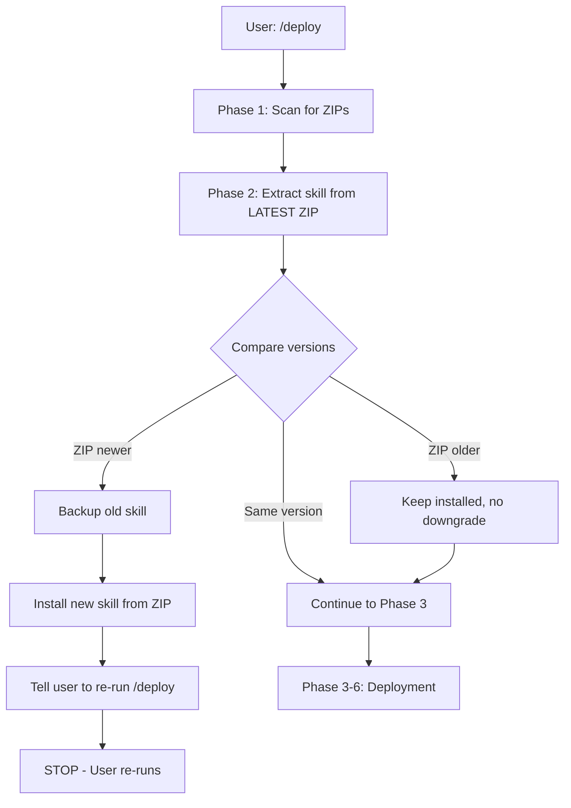

# Phase 2 Changes - Quick Reference

## 📝 Summary

Updated deploy skill to use **pure ZIP-based version management** with no portal API dependencies.

---

## 🔄 What Changed

### Removed
1. ❌ **Phase 1.3** "Check Portal Version" - No longer queries portal API
2. ❌ **Phase 2.4** "Optional: Check Portal Version (Fallback)" - No portal fallback

### Updated
1. ✅ **Phase 2 header** - Clarified ZIP-based approach
2. ✅ **Phase 2.1** - Enhanced description (extract from LATEST ZIP)
3. ✅ **Phase 2.4 (new)** - Added downgrade handling

### Renumbered
- Old Phase 1.4 → New Phase 1.3 (Active Sessions check)

---

## 📋 Before & After Comparison

### Phase 1 Pre-flight Checks

**BEFORE:**
```
Phase 1: Pre-flight Checks
  1.1 Scan for Deployment Kits ✅
  1.2 Parse ZIP Versions ✅
  1.3 Check Portal Version ❌ (REMOVED)
  1.4 Check Active Sessions ✅
```

**AFTER:**
```
Phase 1: Pre-flight Checks
  1.1 Scan for Deployment Kits ✅
  1.2 Parse ZIP Versions ✅
  1.3 Check Active Sessions ✅ (renumbered from 1.4)
```

### Phase 2 Version Management

**BEFORE:**
```
## Phase 2: Version Management

### 2.1 Check ZIP Skill Version (PRIMARY METHOD)
**CRITICAL**: Check the skill version IN THE ZIP FILE first (not portal).

### 2.2 Compare Versions
[auto-update logic]

### 2.3 If Versions Match
[continue]

### 2.4 Optional: Check Portal Version (Fallback) ❌
Only if you want to check for even newer versions on the portal:
- Query: GET /api/deployment/version
- Compare portal version vs current version
- Download if portal has newer
```

**AFTER:**
```
## Phase 2: Skill Version Management (ZIP-Based Auto-Update)

**CRITICAL**: Always check the skill version bundled IN THE ZIP before deploying.
Each deployment kit is self-updating - it contains the exact skill version needed.

**No portal API calls needed** - everything is in the ZIP file.

**Timing**: Run this phase AFTER Phase 1 identifies available ZIPs, but BEFORE
asking user which kit to deploy.

### 2.1 Extract and Check ZIP Skill Version
Identify the LATEST ZIP from Phase 1, then extract its bundled skill:
[extraction commands]

### 2.2 Compare Versions
[auto-update logic - unchanged]

### 2.3 If Versions Match
[continue - unchanged]

### 2.4 If ZIP Skill is Older ✅ (NEW)
If ZIP skill version < installed skill version:
- Log: "ℹ️ Installed skill is newer than ZIP"
- Log: "Keeping installed version (no downgrade)"
- Continue to next phase
```

---

## 🎯 Key Differences

| Aspect | Before | After |
|--------|--------|-------|
| **Portal API for version** | ✅ Optional fallback | ❌ Not used |
| **Version source** | ZIP (primary) + Portal (fallback) | ZIP (only) |
| **Network dependency** | Optional | None for skill updates |
| **Fallback logic** | Complex (try ZIP, then portal) | Simple (ZIP only) |
| **Downgrade handling** | Implicit | Explicit (Phase 2.4) |
| **Active sessions check** | ✅ Phase 1.4 | ✅ Phase 1.3 (renumbered) |

---

## ✅ Benefits of New Approach

### Simpler
- Single source of truth: ZIP file
- No fallback branches
- Clearer logic flow

### Faster
- No API latency
- Local file operations only
- Immediate version comparison

### More Reliable
- Works offline
- No network failures
- Self-contained kits

### Clearer
- Explicit downgrade handling
- Better timing guidance
- Emphasized self-updating nature

---

## 🧪 Testing Scenarios

### Scenario 1: Newer ZIP
```
Installed: 20260116.120000
ZIP:       20260117.043507
Result:    ✅ Auto-update to 20260117.043507
```

### Scenario 2: Same Version
```
Installed: 20260117.043507
ZIP:       20260117.043507
Result:    ✅ Continue with deployment
```

### Scenario 3: Older ZIP
```
Installed: 20260117.043507
ZIP:       20260116.120000
Result:    ✅ Keep installed (no downgrade)
```

### Scenario 4: Offline Deployment
```
Network:   Disconnected
ZIP:       Contains skill v20260117.043507
Result:    ✅ Works perfectly (no API needed)
```

---

## 📦 Deployment Kit Contents (Verified)

```
deployment-kit-{app-name}-{version}.zip
├── deploy-skill.yaml          ✅ Version matches kit version
├── QUICKSTART.md              ✅ Mentions auto-update
├── CLAUDE_PROMPT.md          ✅ Step 0: skill version check
├── config.json                ✅ Contains deployment metadata
├── capsule-deploy.pem         ✅ SSH key
├── README.md                  ✅ Documentation
├── .env.example               ✅ Environment template
└── automation/                ✅ Helper scripts
```

---

## 🚀 What Happens When User Runs /deploy

**New Flow (after Phase 2 update):**



**No portal API calls for skill versioning!**

---

## 📁 Files Modified

1. `/home/ubuntu/src/deploy-portal/deploy-skill.yaml`
   - Lines 34-38: Removed Phase 1.3
   - Lines 40-46: Updated Phase 2 header
   - Lines 48-50: Enhanced Phase 2.1
   - Lines 107-111: Added Phase 2.4 downgrade handling

2. `/home/ubuntu/src/deploy-portal/app.py`
   - No changes needed (already includes skill in ZIPs)

3. `/home/ubuntu/src/deploy-portal/config.py`
   - No changes needed (SKILL_FILE_PATH already correct)

---

## ⏰ Deployment Timeline

| Time | Event |
|------|-------|
| 04:34 UTC | Updated deploy-skill.yaml |
| 04:35 UTC | Restarted deploy-portal service |
| 04:35 UTC | New version: 20260117.043507 |

---

## ✅ Verification Checklist

- [x] deploy-skill.yaml updated
- [x] Portal version check removed (Phase 1.3)
- [x] Portal fallback removed (Phase 2.4)
- [x] Downgrade handling added (new Phase 2.4)
- [x] Service restarted
- [x] deploy-skill.yaml exists and has version placeholder
- [x] Deployment kit generator includes skill
- [ ] Generate test kit and verify
- [ ] Test auto-update with older skill
- [ ] Test offline deployment

---

## 🎯 Key Takeaway

**Deployment kits are now fully self-updating!**

Each kit contains the exact skill version needed for that deployment. No portal API needed for skill updates. Works offline. Simple, fast, reliable.

**Version management = Pure ZIP-based ✅**
**Concurrent protection = Portal API (optional) ✅**

---

**Service Status:** ✅ Running (2026-01-17 04:35:08 UTC)
**Ready For:** Production use, testing, offline deployments 🚀
